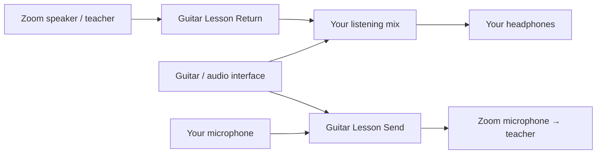

<p align="center">
  
</p>

# AudioRoute — Mac audio routing for AI agents

**Describe what you want to hear. Let your agent build the route.**

Mix your guitar, microphone, and app audio into exactly what each listener needs. AudioRoute gives your coding agent a self-describing macOS CLI to discover devices, create virtual microphones and speakers, save audio routing scenarios, and balance each mix independently.

Tell Codex, Claude Code, or another agent with terminal access what you want. You don’t have to start by writing a routing configuration.

> **Development preview:** [v0.1.0-preview.1](https://github.com/tzvister/audio-router/releases/tag/v0.1.0-preview.1) includes a universal unsigned installer for testing. A signed, notarized installer has not been released yet. This repository is currently private; your agent needs access to it.

## Start with your agent

Copy this into your agent, and change the setup to match yours:

```text
Use AudioRoute to set up my Mac for a guitar lesson on Zoom.

Project: https://github.com/tzvister/audio-router
Read docs/agent-quickstart.md, then use the CLI's built-in help.

My guitar is plugged into input 1 of my audio interface.
I want to use my AirPods microphone for my voice and listen on my AirPods.

The teacher should hear my guitar and voice.
I should hear my guitar and the teacher, but not my own microphone.
The teacher's audio must not be sent back to them.

Discover my actual devices and ask me only for choices you cannot determine.
Create explicit “Guitar Lesson Send” and “Guitar Lesson Return” virtual devices,
configure and save the scenario, and help me select them in Zoom.
Validate the route, apply it, and test it with me. Balance my voice and guitar
independently, and save the final levels so I can use the setup again.
If AudioRoute is not installed, explain the available installation path first.
```

For a different setup, describe **your sources**, **what each destination should hear**, and **what it should never hear**. Your agent can use the same workflow to create a named scenario for that mix.

## Your guitar lesson, with the right mix for each person

| Destination | What they hear |
| --- | --- |
| Your teacher on Zoom | Your guitar + your voice |
| Your AirPods | Your guitar + the teacher |

The teacher’s return is excluded from the outgoing mix. Your microphone is excluded from your headphones. Turning up the guitar for yourself doesn’t have to turn it up for the teacher.

In Zoom, the selections are explicit:

| Zoom setting | Select |
| --- | --- |
| Microphone | **Guitar Lesson Send** |
| Speaker | **Guitar Lesson Return** |



Zoom sends its audio to the virtual Return speaker. AudioRoute mixes that with your guitar and plays the result through your headphones. This setup uses explicit device routing—no application audio interception is needed.

## Keep adjusting in plain language

Once your agent has created the route, ask for changes such as:

- “My voice is louder than my guitar. Lower my voice for the teacher.”
- “Turn my guitar up in my headphones, but leave the teacher’s mix alone.”
- “Make the teacher a little louder for me.”
- “Check whether Zoom is receiving audio, and help me test it.”
- “Save these levels for my next lesson.”

Your agent translates those requests into CLI operations. AudioRoute handles the audio locally; it does not include a built-in AI assistant or send your audio to an AI service.

## Why AudioRoute?

- **Separate mixes for separate listeners.** Control source levels independently in each destination.
- **Named virtual audio devices.** Choose a virtual microphone or speaker directly in apps with audio device selectors.
- **A setup you can reuse.** Named scenarios and level changes persist across background-app restarts.
- **Built for agents and scripts.** Discoverable commands, JSON responses, configuration schema, examples, validation, and dry runs.
- **Checks that help you troubleshoot.** Inspect connections, signal levels, device writes, and dropouts—then confirm the result by listening.

Application audio capture is also available for apps that don’t offer an output selector. Your agent can choose that approach when it fits the setup.

## Get AudioRoute on your Mac

Requires **macOS 14.2 or later**. Universal binaries contain both Apple Silicon and Intel support; real-world Intel audio testing is still pending.

**Today:** download the [developer preview](https://github.com/tzvister/audio-router/releases/tag/v0.1.0-preview.1) for evaluation, or build from source. The preview installer is unsigned and not notarized; macOS may block it under normal security settings. It is not the finished consumer install experience. An agent with access to the repository can follow the [source setup instructions](docs/development.md). That path requires Xcode and administrator approval to install the audio driver. It is not yet the intended one-download experience.

**For the first signed release:** the planned flow is one `.pkg` from [GitHub Releases](https://github.com/tzvister/audio-router/releases), macOS Installer approval, a restart to load the driver, and:

```sh
audioroute setup --start
```

The package includes the CLI, background app, virtual audio driver, and transport service. End users won’t need a compiler or separate driver downloads. Your agent can then discover your devices and build the scenario. You handle macOS privacy prompts and confirm what you hear.

## Prefer the terminal?

Everything an agent needs to learn the CLI is available from the executable:

```sh
audioroute --help --json         # Discover commands and their arguments
audioroute guide                # Learn the complete routing workflow
audioroute schema               # Inspect the configuration schema
audioroute examples             # Find editable scenario templates
audioroute setup                # Check installation without changing audio
```

Help, the guide, schema, and examples work without a running background app. For detailed command syntax, use `audioroute help level set` or read the [CLI reference](docs/cli.md).

## Before your first lesson

Local testing has confirmed guitar monitoring in AirPods, guitar and voice in Zoom’s microphone playback test, independent levels, and Zoom audio through the explicit virtual Return device. A real remote lesson and clean-machine signed installation remain to be verified. See the [verification record](docs/verification.md).

Bluetooth adds delay and can change playback behavior when its microphone is active. AudioRoute cannot remove that hardware latency. This preview supports one routing account per Mac. Successful configuration and moving meters are useful checks; your listening test confirms whether the intended sound reaches you.

## Learn more

[Agent quickstart](docs/agent-quickstart.md) · [CLI reference](docs/cli.md) · [Testing](docs/testing.md) · [Build from source](docs/development.md) · [Release packaging](docs/releasing.md)
