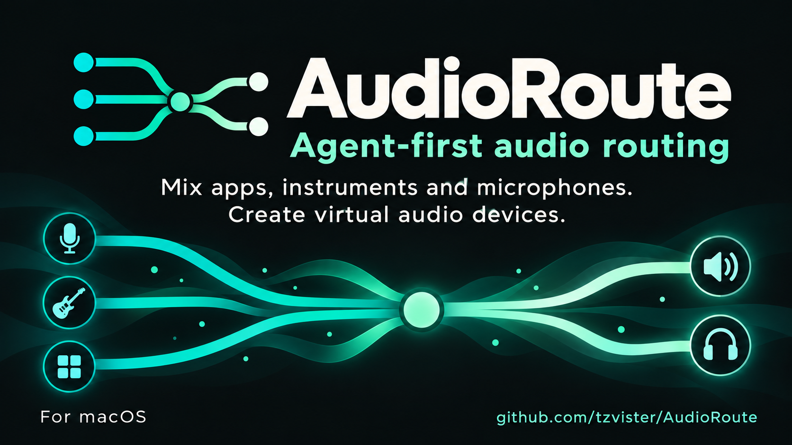
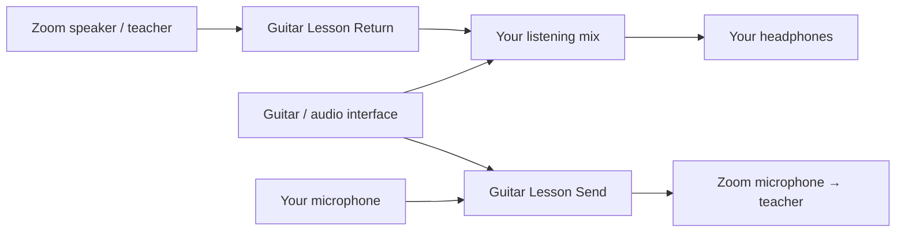

<p align="center">
  
</p>

# AudioRoute

**Tell your agent what each person should hear. AudioRoute builds the mix on your Mac.**

Mix apps, instruments, and microphones. Create virtual microphones and speakers that you can select in Zoom and other audio apps.

## Your guitar lesson, with the right mix for each person

| Destination | What they hear |
| --- | --- |
| Your teacher on Zoom | Your guitar + your voice |
| Your AirPods | Your guitar + the teacher |

Your teacher hears your guitar and voice. You hear your guitar and the teacher, without your own microphone playing back in your ears. The teacher’s audio never loops back into their call.

Each mix has its own levels: turn up your guitar in your AirPods without changing what the teacher hears.

Your agent creates two virtual devices. Select them in Zoom:

| Zoom setting | Select |
| --- | --- |
| Microphone | **Guitar Lesson Send** |
| Speaker | **Guitar Lesson Return** |



Zoom sends the teacher’s audio to **Guitar Lesson Return**. AudioRoute adds your guitar and plays that mix through your AirPods. **Guitar Lesson Send** carries your guitar and voice to the teacher.

Describe the lesson to your agent, and it can discover your devices, create this route, help you test it, and save it for next time.

## 1. Chat with Claude Code or Codex

Imagine telling your agent: **“Let my guitar teacher hear my guitar and voice, while I hear my guitar and the teacher.”** AudioRoute makes that mix possible—and lets you change it just by asking.

Once installed, open **Claude Code or Codex on this Mac**, with access to your terminal. Paste this, or describe your own setup:

```text
Use AudioRoute to set up my audio.
Run audioroute --help --json and audioroute guide to learn how it works.
Check audioroute setup, discover my devices, and help me test the result.

I want a guitar lesson on Zoom:
- My guitar is on input 1 of my audio interface.
- Use my AirPods microphone for my voice and AirPods for listening.
- My teacher should hear my guitar and voice.
- I should hear my guitar and the teacher, without monitoring my own voice.
- Do not send the teacher's audio back to them.

Create and save this route. Help me choose its virtual microphone and
speaker in Zoom, test it with me, and balance the levels.
```

Your agent learns the commands from the CLI itself. You approve any macOS microphone permission prompts and confirm what you hear.

Keep chatting to adjust the mix:

> “Lower my voice for the teacher.”
>
> “Turn up my guitar only in my headphones.”
>
> “Save this setup for my next lesson.”

AudioRoute runs the audio locally. Claude Code or Codex controls it through the CLI.

## 2. Install AudioRoute

Ready to try it? You’ll need **macOS 14.2 or later**, on an Apple Silicon or Intel Mac.

1. **[Get the newest download](https://github.com/tzvister/AudioRoute/releases).** Open the top release, then choose the file ending in **`universal-unsigned.pkg`** under **Assets**. When signed installers become available, choose **`universal.pkg`**.
2. Open the download and follow the installer. Your Mac will ask for your password to allow installation.
3. Restart your Mac, then ask your agent:

   ```text
   Run audioroute setup --start, check that AudioRoute is ready,
   and help me create my audio setup.
   ```

**What goes on your Mac?** The AudioRoute app, a command your agent can use, and a small background service with an audio driver. Together, they create virtual microphones and speakers that apps such as Zoom can use. Your agent controls which sounds go into each mix.

You can **uninstall AudioRoute at any time** using the removal package below. Updates and uninstalling keep your saved setups, so you can use them again later.

**A quick heads-up:** these are early, unsigned previews, so macOS may block the download. We’re working toward Apple-signed installers; progress is tracked in [issue #2](https://github.com/tzvister/AudioRoute/issues/2).

## Uninstall

Download the **uninstaller** `.pkg` from the [newest GitHub release](https://github.com/tzvister/AudioRoute/releases). Finish any calls or recordings that use AudioRoute, open the package, approve the administrator prompt, and restart your Mac.

The uninstaller removes the app, CLI, virtual audio driver, and transport service. It keeps saved routes and virtual-device configuration for a future reinstall.

If you prefer Terminal:

```sh
audioroute daemon stop
sudo launchctl bootout system/org.audioroute.transport
sudo rm -f /Library/LaunchDaemons/org.audioroute.transport.plist
sudo rm -rf /Library/Audio/Plug-Ins/HAL/AudioRoute.driver
sudo rm -rf /Applications/AudioRoute.app
sudo rm -f /usr/local/bin/audioroute
```

Restart afterward. If the daemon or transport service is already stopped, continue with removal.

## More help

[Agent quickstart](docs/agent-quickstart.md) · [CLI reference](docs/cli.md) · [Troubleshooting channels](docs/channel-troubleshooting.md) · [Build from source](docs/development.md) · [Verification record](docs/verification.md)
